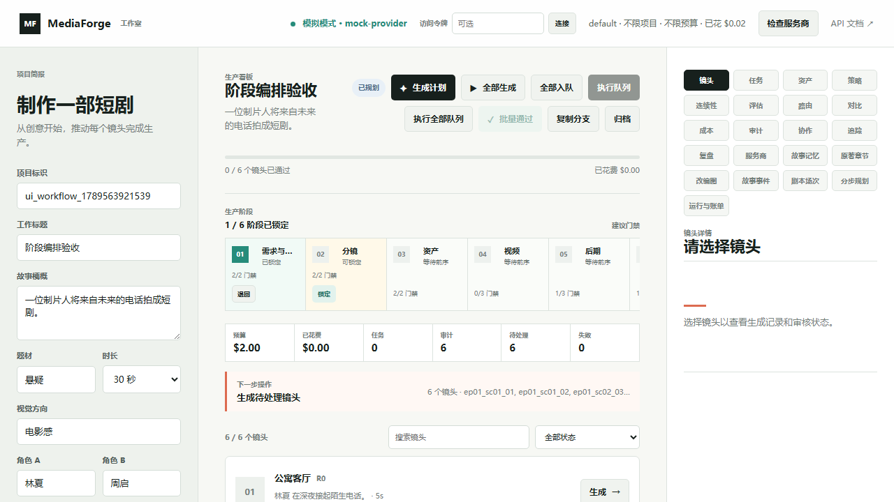
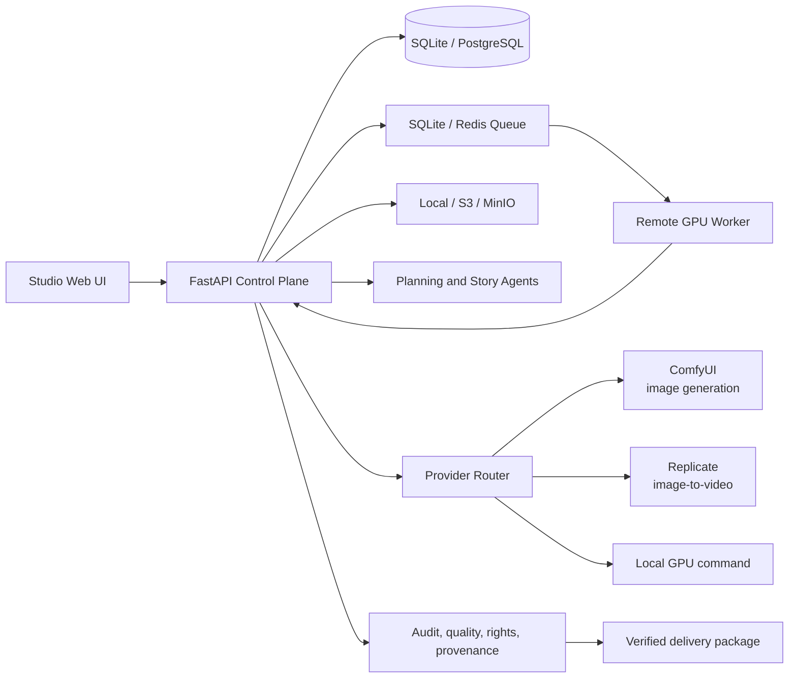

# MediaForge

> 面向内容团队的 AI 媒体生产编排、质量治理与可审计交付平台。

[](https://github.com/cun8cun8/mediaforge-aigc-production-platform/actions/workflows/ci.yml)
[](https://www.python.org/)
[](https://fastapi.tiangolo.com/)
[](docs/release-checklist.md)

MediaForge 将短剧、广告片和系列化内容的生产过程组织为可追溯的闭环：从原始素材与故事事件、剧本和分镜，到参考资产、图像/视频生成、人工审核、音频与字幕、交付包、发布和复盘。它不是一个单一模型的包装器，而是将模型、工作流、素材权利、成本、质量和审批证据纳入同一生产控制面。



## 为什么是 MediaForge

短视频生成工具通常擅长完成一次创作，但团队生产需要回答更多问题：

- 这支视频基于哪一版剧本、分镜和参考资产生成？
- 某次修改会影响哪些下游镜头，是否必须返工？
- 某个模型、工作流、LoRA 或素材是否有权利记录？
- 任务失败、超预算或服务商不可用时，谁接管、如何重试、成本是否可查？
- 成片交付后，是否能复验媒体哈希、审核记录、来源和发布证据？

MediaForge 以这些问题为第一等能力，提供：

| 能力域 | 已有能力 |
| --- | --- |
| 创意到分镜 | 原著导入、故事事件、Story Bible、剧本场次、可恢复规划、镜头卡 |
| 生产编排 | 六阶段门禁、阶段锁定、返工影响分析、任务队列、Worker 租约与失败恢复 |
| 生成接入 | Mock、ComfyUI 图像、Replicate 图生视频、本地 GPU 命令适配器、能力路由与故障切换 |
| 后期与资产 | 参考图、资产哈希、字幕与对白、音频、口型同步适配器、FFmpeg 导出与交付 ZIP |
| 治理 | 审批、审计、质量评估、成本台账、许可证台账、来源链路、连续性和合规报告 |
| 企业运行 | OIDC、租户隔离、PostgreSQL、Redis、S3/MinIO、GPU Worker、指标与告警 |

## 六阶段生产闭环

每个阶段都根据真实产物计算门禁。锁定时会保存证据指纹；上游剧本、分镜、资产、视频或后期输入变更时，受影响阶段和下游阶段会自动失效并留下审计记录。

| 阶段 | 关键输入 | 锁定证据 | 下游结果 |
| --- | --- | --- | --- |
| 01 需求与剧本 | 项目 Brief、Story Bible、故事事件 | 已确认叙事和项目需求 | 可规划的故事基线 |
| 02 分镜 | 场次、镜头、节奏和时长 | 镜头列表与时长校验 | 可执行镜头规格 |
| 03 资产 | 角色、场景、风格和参考图 | 参考资产清单与权利记录 | 可追溯的生成输入 |
| 04 视频 | Provider、Prompt、镜头任务 | 已生成且通过质量和审核的媒体 | 可进入后期的主素材 |
| 05 后期 | 音频、对白、字幕和剪辑输入 | 成片、字幕和当前对白时间线 | 可验证的交付候选 |
| 06 交付 | 交付包、合规和连续性报告 | 已验证包与发布证据 | 可分发、可复验的交付物 |

生产环境设置 `MEDIAFORGE_REQUIRE_STAGE_LOCKS=true` 后，未锁定资产不能提交生成，未锁定视频不能导出，未锁定后期不能打包，未锁定交付不能发布。详见[生产工作流与架构](docs/architecture.md)。

## 快速开始

### 前置条件

- Python 3.12+
- Node.js 22+，仅在运行浏览器验收测试时需要
- Git
- 可选：Docker Desktop、NVIDIA GPU、ComfyUI、PostgreSQL、Redis、MinIO/S3

### 本地 Mock 工作台

Mock 模式不会调用付费模型，适合体验完整的项目、分镜、审核、导出和交付治理流程。

```powershell
git clone git@github.com:cun8cun8/mediaforge-aigc-production-platform.git
cd mediaforge-aigc-production-platform

python -m pip install -e ".[dev,agents]"
$env:MEDIAFORGE_AUTH_MODE = "disabled"
$env:MEDIAFORGE_PROVIDER = "mock"
$env:MEDIAFORGE_LLM_MODE = "disabled"
$env:MEDIAFORGE_RATE_LIMIT_ENABLED = "false"
$env:MEDIAFORGE_ARTIFACT_ROOT = "artifacts/local"

python -m uvicorn mediaforge_p1.api:create_app --factory --host 127.0.0.1 --port 8020
```

浏览器访问 [http://127.0.0.1:8020](http://127.0.0.1:8020)。创建项目后，可按以下顺序完成最小闭环：

1. 填写 Brief，生成计划和镜头。
2. 在“生产阶段”锁定需求与剧本、分镜和资产。
3. 生成或排队镜头，在“镜头”中审核质量与版本。
4. 锁定视频，生成对白/字幕/音频并导出成片。
5. 锁定后期，构建并验证交付包；锁定交付后发布。

### 验证本地环境

```powershell
python -m mediaforge_p1.api_smoke --base-url http://127.0.0.1:8020
Invoke-RestMethod http://127.0.0.1:8020/providers/diagnostics

npm ci
npm run install:browsers
$env:MEDIAFORGE_UI_URL = "http://127.0.0.1:8020"
npm run test:ui
npm run test:ui:workflow
```

## 架构概览



控制面保存项目状态、审计和任务事实；队列负责可恢复调度；媒体文件和交付包进入受控 artifact 根目录或对象存储。Provider 始终经由稳定契约接入，不能直接改写项目状态。更完整的边界、数据流和扩展点见[架构说明](docs/architecture.md)。

## 接入真实生成能力

先在预发布环境完成一次低成本 Probe 和一条完整交付链路，再切生产流量。不要把 API Token、工作流权重、数据库密码或真实素材提交到 Git。

| Provider | 适用能力 | 关键配置 | 生产建议 |
| --- | --- | --- | --- |
| `mock` | 本地闭环验证 | `MEDIAFORGE_PROVIDER=mock` | 仅开发与演示 |
| `comfyui` | 审核后的图像生成、图生视频 | `COMFYUI_BASE_URL`、审核后的工作流注册表 | 固定 workflow 版本、SHA-256 与能力声明 |
| `replicate` | 图生视频 | `REPLICATE_API_TOKEN`、固定 `REPLICATE_MODEL_VERSION` | 预算限额、回调与失败策略 |
| `local` | 自建 GPU 模型 | `MEDIAFORGE_LOCAL_PROVIDER_COMMAND` | 用独立 Worker 镜像运行模型 |

推荐的生产路由是 `comfyui,replicate`：本地或私有网络完成审核后的图像或视频生产，云端作为图生视频备选；也可通过 `local` 接入经审核的自建模型。ComfyUI 只暴露其注册表条目声明的 `image_generation`、`image_to_video` 能力，Replicate 当前适配 `image_to_video`，不要将模板与能力误配。

```powershell
$env:MEDIAFORGE_PROVIDERS = "comfyui,replicate"
$env:COMFYUI_BASE_URL = "http://comfyui.internal:8188"
$env:COMFYUI_WORKFLOW_REGISTRY_PATH = "D:\secure-config\comfyui-workflow-registry.json"
$env:COMFYUI_REQUIRE_WORKFLOW_PIN = "true"
$env:MEDIAFORGE_IMAGE_WORKFLOW_TEMPLATE_ID = "comfyui_image:reviewed:v1"
$env:MEDIAFORGE_VIDEO_WORKFLOW_TEMPLATE_ID = "comfyui_video:reviewed:v1"
$env:REPLICATE_API_TOKEN = "<from-secret-manager>"
$env:REPLICATE_MODEL_VERSION = "<approved-pinned-model-version>"
$env:MEDIAFORGE_CALLBACK_SECRET = "<long-random-secret>"

mediaforge-comfyui-preflight --registry D:\secure-config\comfyui-workflow-registry.json
python -m mediaforge_p1.provider_probe --provider comfyui --registry D:\secure-config\comfyui-workflow-registry.json --template-id comfyui_image:reviewed:v1 --require-workflow-pin
python -m mediaforge_p1.provider_probe --provider comfyui --registry D:\secure-config\comfyui-workflow-registry.json --template-id comfyui_video:reviewed:v1 --capability image_to_video --require-workflow-pin
python -m mediaforge_p1.provider_probe --provider replicate
```

在生产 Provider 模式下，异步回调必须携带 HMAC-SHA256 签名；控制面会校验回调时间窗、事件幂等性、任务租约和 Provider 路由。详细步骤见 [ComfyUI 接入](docs/comfyui-provider.md)、[Replicate 接入](docs/replicate-provider.md) 和[配置参考](docs/configuration.md)。

## 从本地到生产

| 环境 | 目标 | 最小组成 | 入口 |
| --- | --- | --- | --- |
| 本地开发 | 验证产品闭环 | Mock、SQLite、文件系统 | 本页快速开始 |
| 预发布 | 验证真实模型与回调 | 真实 Provider、单 API、受控 Secret | [配置参考](docs/configuration.md) |
| 团队生产 | 多 Worker、持久队列和对象交付 | PostgreSQL、Redis、S3/MinIO、GPU Worker、OIDC | [生产部署](docs/production-deployment.md) |
| 高可用 | 控制面故障切换 | leased API、Nginx、共享 RWX 存储、监控 | `docker-compose.ha.yml`、[发布清单](docs/release-checklist.md) |
| Kubernetes | 多节点和 GPU 资源编排 | `k8s/base` 与 GPU/网络策略 overlay | [Kubernetes 指南](k8s/README.md) |

### 本地预发布基线

仓库提供单控制面的预发布 Compose，用于在接入真实模型前验证 PostgreSQL、Redis、MinIO、鉴权、阶段锁定、对象归档和 Worker 租约。它不会打包 GPU 模型或代替生产高可用部署。

```powershell
.\ops\staging\bootstrap.ps1
docker compose -f docker-compose.staging.yml up --build -d
.\ops\staging\verify.ps1
```

工作台地址为 [http://127.0.0.1:8021](http://127.0.0.1:8021)。默认使用 Mock Provider；在成本审批和工作流审核完成后，再按[预发布指南](ops/staging/README.md#comfyui-staging-profile)启用 ComfyUI。

生产运行的核心变量：

```text
MEDIAFORGE_STATE_BACKEND=postgres
MEDIAFORGE_DATABASE_URL=postgresql://...
MEDIAFORGE_QUEUE_BACKEND=redis
MEDIAFORGE_REDIS_URL=redis://...
MEDIAFORGE_STORAGE_MODE=s3
MEDIAFORGE_STORAGE_ENDPOINT=https://minio-or-s3.example.com
MEDIAFORGE_STORAGE_BUCKET=mediaforge-artifacts
MEDIAFORGE_AUTH_MODE=oidc
MEDIAFORGE_REQUIRE_STAGE_LOCKS=true
```

生产发布前执行：

```powershell
mediaforge-production-acceptance `
  --base-url https://staging.example.com `
  --token $env:MEDIAFORGE_READINESS_TOKEN `
  --probe-enterprise `
  --probe-planning `
  --release-project <released-project-id> `
  --require-production
```

## 工程结构

```text
src/mediaforge_p1/       FastAPI 控制面、编排、Provider、Worker、治理和 Studio 静态资源
tests/                   API、企业适配器、工作流和浏览器验收测试
docs/                    架构、Provider、部署、配置、运行时参考和发布材料
k8s/                     基础清单、GPU Worker、网络隔离 overlay
ops/                     备份恢复、Nginx、负载基线、Prometheus/Grafana/Alertmanager
.github/workflows/       CI 与受保护的人工 Kubernetes 部署工作流
```

## 测试与持续集成

```powershell
python -m pytest -q
python -m compileall -q src tests
npm run test:ui
npm run test:ui:workflow
```

GitHub Actions 会运行 Python 回归、浏览器验收、Compose/Kubernetes 渲染验证和生产镜像构建。手工部署工作流只接受已审核的镜像引用，并先执行 Kubernetes server-side dry run。详见 [`.github/workflows`](.github/workflows)。

## 文档导航

| 主题 | 文档 |
| --- | --- |
| 系统边界、数据流与扩展点 | [架构说明](docs/architecture.md) |
| 本地/预发布/生产变量 | [配置参考](docs/configuration.md) |
| 真实 Provider 和工作流 pinning | [ComfyUI](docs/comfyui-provider.md) / [Replicate](docs/replicate-provider.md) |
| 分阶段规划、人工复核和恢复 | [Staged Planning](docs/staged-planning.md) |
| PostgreSQL、Redis、MinIO、OIDC、监控、备份 | [生产部署](docs/production-deployment.md) |
| 发布前质量门与运维验收 | [发布清单](docs/release-checklist.md) |
| 单控制面预发布 Compose 与 ComfyUI 切换 | [预发布指南](ops/staging/README.md) |
| 所有运行时 API 与细节 | [运行时参考](docs/runtime-reference.md) |
| 早期选型和技术调研 | [P-1 技术研究](docs/p1-technical-research.md) |

## 贡献与安全

欢迎通过 Issue 和 Pull Request 参与，但请先阅读：

- [贡献指南](CONTRIBUTING.md)：开发环境、分支、测试、提交与 PR 标准。
- [安全策略](SECURITY.md)：漏洞报告方式、支持范围和 Secret 处理规则。
- [发布清单](docs/release-checklist.md)：从代码合并到生产发布的责任边界。

本仓库当前未附带对外授权的 `LICENSE` 文件。除非仓库所有者另行发布许可证，代码仅供受邀协作者在项目约定范围内使用；在公开发布、再分发或接入第三方模型权重前，应完成独立的许可证与内容权利审查。

## 致谢与参考

MediaForge 的仓库体验借鉴了成熟的 AI 内容生产项目：清晰的产品定位、快速启动、部署分层和贡献入口。比如 [Toonflow](https://github.com/HBAI-Ltd/Toonflow-app) 展示了从故事到视频的一站式短剧创作产品表达；MediaForge 则聚焦于可插拔 Provider、生产治理、团队协作和可验证交付，而非复用其源码、界面或许可证条款。
