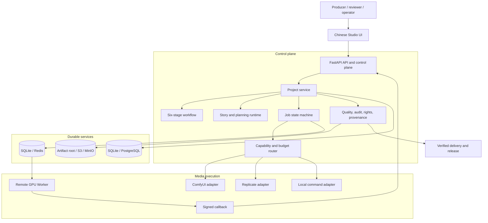
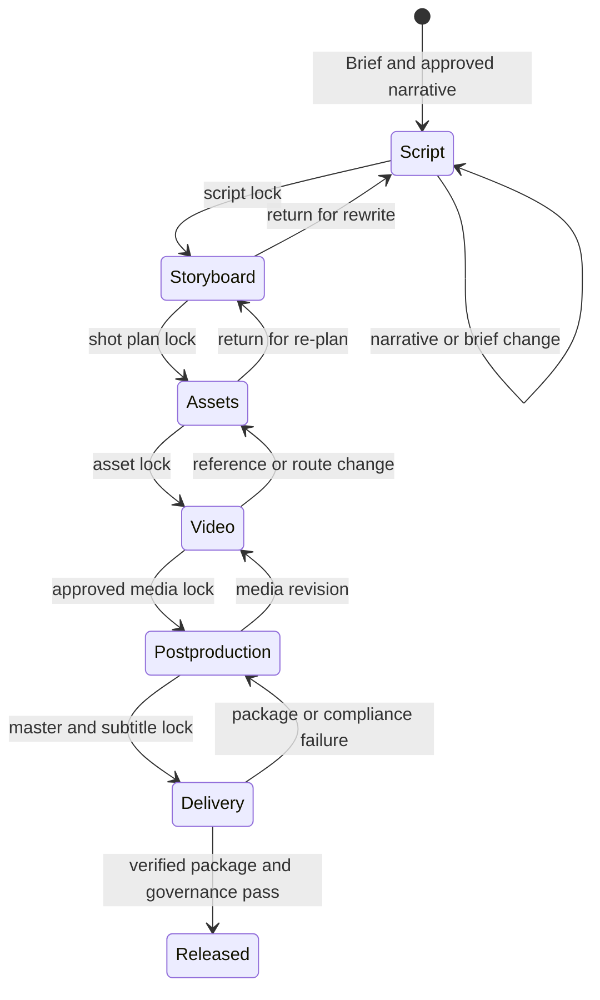
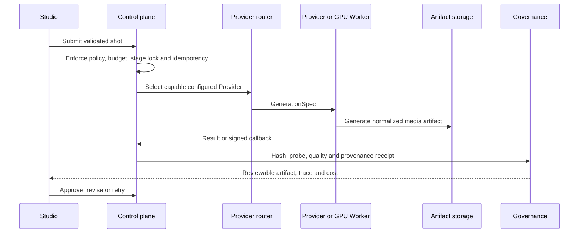

# MediaForge Architecture

## Design Intent

MediaForge is a production control plane for AI media generation. It makes content production reproducible and reviewable without coupling the business workflow to one model vendor, one GPU stack, or one storage backend.

The design targets a closed production loop:

```text
source material -> narrative -> storyboard -> approved assets -> media jobs
-> review -> post-production -> verified package -> delivery -> retrospective
```

### Principles

1. **State is explicit.** Project, shot, job, audit, approval, cost, rights and release states are persisted; a model response is never the source of truth by itself.
2. **Providers are adapters.** A Provider receives a validated `GenerationSpec` and returns an artifact. It cannot mutate project state directly.
3. **Human review is a gate.** Agent output, generated media and release decisions all remain reviewable and reversible until the relevant production stage is locked.
4. **Evidence travels with media.** Hashes, workflow identity, prompt version, Provider receipt, quality result and approval records are included in inventory, trace and delivery artifacts.
5. **Production is progressive.** SQLite and Mock support local development; PostgreSQL, Redis, object storage, OIDC and remote GPU Workers can be introduced independently.

## Component Map



### Ownership Boundaries

| Boundary | Owns | Does not own |
| --- | --- | --- |
| Studio UI | Project interaction, review and operational visibility | Provider credentials or direct model execution |
| API control plane | Validation, state transition, routing, governance and audit | GPU model weights or long-running worker process lifetime |
| Provider adapter | One Provider protocol and artifact receipt normalization | Business workflow, approval and release policy |
| Worker | Job lease, local GPU execution and signed result callback | Project edits or cross-tenant scheduling decisions |
| State backend | Durable project and lease snapshots | Media blobs or immutable external archive guarantees |
| Object storage | Delivery archive and object integrity receipts | Editable production workspace semantics |

## Six-Stage Workflow



Each stage contains:

- **Gates:** machine-verifiable evidence such as story inputs, shot duration, reference asset inventory, passed media quality checks, final MP4, subtitles and delivery checksum.
- **Lock fingerprint:** a deterministic view of evidence at the time of approval.
- **Invalidation:** an upstream change invalidates downstream locks and records the affected scope. It does not silently delete approved artifacts.
- **Strict enforcement:** `MEDIAFORGE_REQUIRE_STAGE_LOCKS=true` turns advisory gates into API enforcement for generation, export, package and release.

The exact gates live in `src/mediaforge_p1/production_workflow.py` and are surfaced by `GET /projects/{project_id}/workflow`.

## Request And Artifact Lifecycle



All terminal work is represented by a Job state transition. Provider HTTP retries are intentionally separate from Job retries: short transient transport retries happen within one attempt, while a failed Job creates a fresh auditable attempt under bounded retry policy. Leases prevent a process crash from leaving a Job permanently running.

## Provider Model

The supported Provider contract is capability-oriented:

| Provider | Current capability | Execution pattern | Notes |
| --- | --- | --- | --- |
| Mock | image/video simulation | In-process | Development and deterministic tests only |
| ComfyUI | `image_generation` | HTTP workflow submit and poll | Reviewed API-format graph and optional SHA-256 pinning |
| Replicate | `image_to_video` | Version-pinned HTTP prediction | Stable idempotency key and bounded retry policy |
| Local | configured capabilities | Child process or remote GPU Worker | Command must emit a valid PNG or MP4 at the declared output path |

The current ComfyUI adapter deliberately exposes only reviewed bindings and does not let an Agent mutate arbitrary workflow nodes. The current Replicate adapter handles image-to-video. This division is intentional: route by declared capability, not by a best-effort guess based on a model name.

For a local GPU cluster, the API may publish work to the queue while a Worker runs `local-provider-callback`. The Worker must have a valid job lease, write to the shared artifact root, and send a signed `RUNNING` or terminal callback to the control plane. The callback is verified against its request body, timestamp, route and lease.

## Persistence And Scaling

| Layer | Local default | Production option | Reason |
| --- | --- | --- | --- |
| Project state | SQLite | PostgreSQL | Durable snapshots and leased active/passive control plane |
| Ready queue | SQLite | Redis | Recoverable ready index and concurrent Worker claims |
| Artifact workspace | Local filesystem | Shared RWX volume | Editable media and worker-visible paths |
| Delivery archive | Local filesystem | S3/MinIO | Verified, versionable delivery artifact storage |
| Identity | Disabled or API key | OIDC + PKCE | Organization claims, browser SSO and tenant mapping |
| Metrics | `/metrics` | Prometheus + Alertmanager + Grafana | Deployment-owned monitoring and alert routing |

Redis is not the source of truth for production jobs; durable project state and leases remain authoritative. Likewise, S3/MinIO archives delivery packages while active media production still needs a writable working location visible to the API and Workers.

## Governance Path

The release path checks more than file existence:

1. Media quality and review status.
2. Story/timeline continuity and current dialogue/subtitle state.
3. Source and asset license registry evidence.
4. Provider, workflow, prompt and artifact provenance.
5. Delivery ZIP integrity and optional external delivery receipt.
6. Audit and chain-of-custody report.

Content credentials are represented in the evidence model. A credential stays `UNSIGNED` until an operator-configured signing command emits it, and `SIGNED_UNVERIFIED` until an independent verifier confirms it. This prevents a configuration label from being mistaken for a real C2PA signature.

## Extension Rules

Add an integration by extending an adapter boundary instead of changing the project state machine:

- New image/video vendor: implement `GenerationProvider`, declare supported `Capability` values, normalize artifact metadata and register through `config.py`.
- New planning model: use the planning abstraction and preserve review/resume checkpoints.
- New storage/identity/queue integration: add an enterprise runtime adapter and retain tenant and audit behavior.
- New workflow stage: define gates, fingerprints and invalidation effects before adding UI controls.

Before a production integration is accepted, run the provider probe, build a known project, inspect the trace/provenance/rights reports, verify a delivery package, and perform a failed-job recovery drill. See the [release checklist](release-checklist.md).
