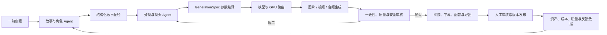
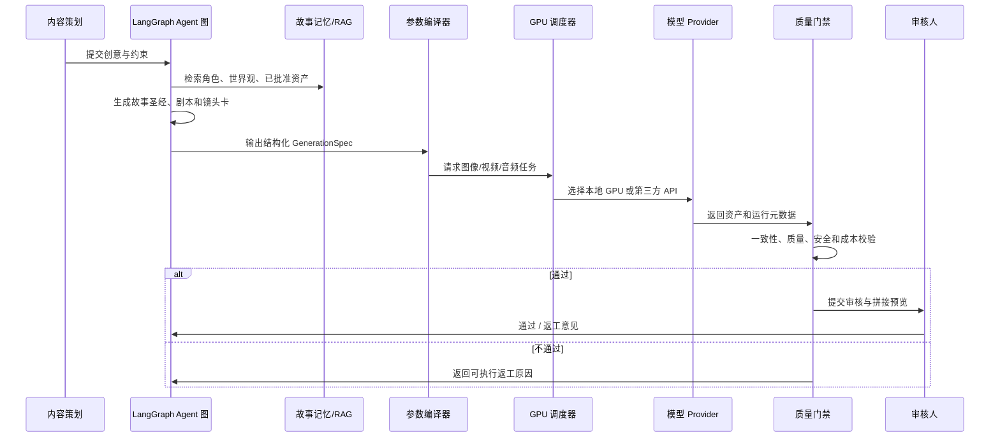
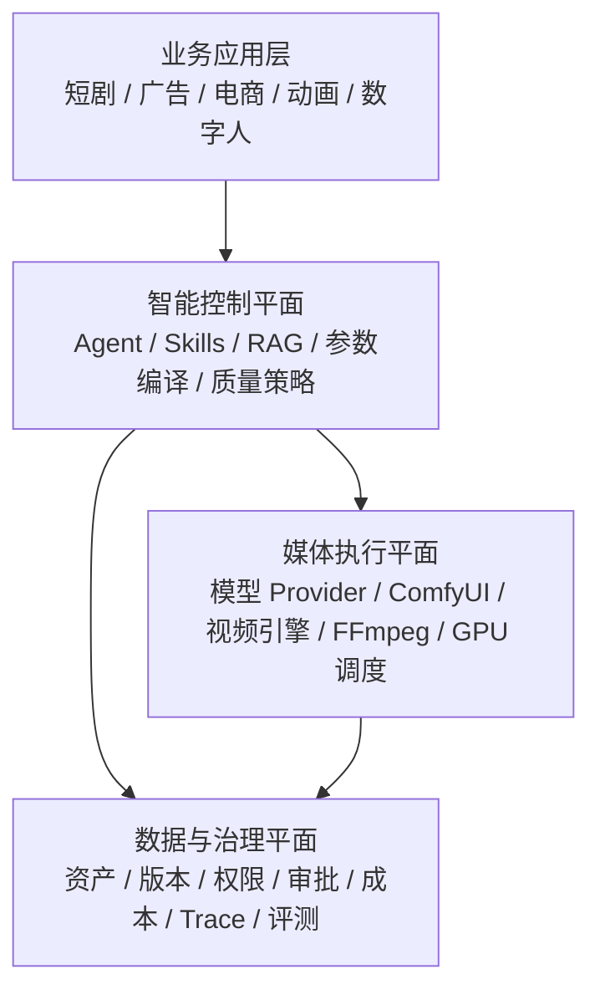
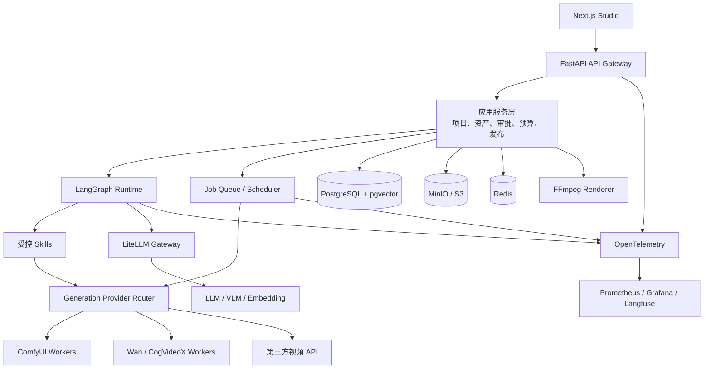

# 备选项目方案：MediaForge AIGC 媒体生产智能体与异构算力平台

> 项目代号：`MediaForge`  
> 首个垂直场景：AIGC 短剧生产  
> 平台定位：面向内容团队、创作工具团队和 AIGC 产品团队的媒体生产编排、质量治理与 GPU 资源平台  
> 文档状态：已评估的收敛立项方案，不属于当前智能采购平台的功能范围  
> 核心原则：以完整业务闭环为首要设计目标；短剧是业务楔子，可复用的 Agent、资产、模型、工作流、算力和治理能力才是平台本体

## 1. 执行摘要

MediaForge 将“一句话创意到可审核短剧样片”的生产过程拆分为可追溯、可调度、可评测的业务单元：故事设定、角色圣经、分集剧本、镜头分镜、图像/视频生成、配音、拼接、质量检查、人工返工和发布。

它不训练新的视频基础模型，不试图复制 Sora、Runway 或可灵等模型能力；也不把 ComfyUI 当作产品本体。平台的价值是为不同模型和不同媒体工作流提供统一的 Agent 编排、参数编译、GPU 队列、资产记忆、质量门禁、成本治理和审计能力。



产品以短剧验证业务闭环，后续可复用至广告、品牌内容、电商视频、动画、游戏剧情和数字人内容生产。

本项目的第一设计目标不是单点能力展示，而是跑通一条可重复执行的完整业务闭环：

```text
Brief 输入
  -> 故事与角色设定
  -> 剧本与镜头卡
  -> GenerationSpec 编译与校验
  -> 任务排队与 Provider 执行
  -> 资产入库与质量检查
  -> 人工审核
  -> 返工 / 重跑
  -> FFmpeg 拼接导出
  -> 成本、Trace、版本和审核记录归档
```

这里的“完整”指首期业务链路完整，不指一期完成所有模型、所有媒体类型、企业级多租户或大规模 GPU 集群。

## 2. 项目目标与边界

### 2.1 目标

1. 首期完成从创意到 30 至 60 秒短剧样片的完整、可重复运行闭环，后续再扩展到 1 至 3 分钟。
2. 证明 LLM Agent 能将自然语言创意编译为受约束的剧本、角色、分镜和模型参数，而不是自由拼接 Prompt。
3. 证明多个生成模型、ComfyUI 工作流、本地 GPU 和第三方 API 可由统一 Provider Contract 调度。
4. 建立角色一致性、剧情连续性、结构化输出、内容安全、成本和时延的质量门禁。
5. 让每个镜头、每次返工、每笔 GPU/API 成本和每次人工审批可追溯。
6. 将首个短剧案例沉淀为可被广告、电商和动画业务复用的平台能力。

### 2.2 明确不做什么

| 不做事项 | 原因 |
| --- | --- |
| 从零训练文生视频或图生视频基础模型 | 算力、数据和研究投入远超平台项目合理范围 |
| 一期支持所有视频模型、所有风格和所有内容平台 | 会稀释首个业务闭环，造成不可测试的集成堆积 |
| 让 Agent 无约束调用模型参数或直接发布内容 | 生成成本、版权与内容风险不可控 |
| 第一阶段实现 Kubernetes、跨地域多集群和大规模 GPU 弹性 | 这些是规模化能力，不是 MVP 的价值证明 |
| 依赖并暴露原始 Chain-of-Thought | 采用结构化计划、证据、规则与评测记录替代 |

### 2.3 评分目标

| 维度 | 目标评分 | 达成条件 |
| --- | ---: | --- |
| AIGC 技术价值 | 9.6 / 10 | LLM、Diffusion、视频生成、多模态评测与模型路由均真实接入 |
| Agent 工程价值 | 9.5 / 10 | 有状态编排、受控 Skill、结构化输出、审批、回放和评测闭环 |
| 平台架构价值 | 9.4 / 10 | Provider Contract、GPU 队列、资产与工作流版本、可观测性和多租户边界完整 |
| 业务价值 | 8.8 / 10 | 对高频视频内容生产团队有明确成本、时效、一致性和质量收益 |
| 岗位匹配度 | 9.5 / 10 | 覆盖截图中的 AIGC 平台、GPU 调度、ComfyUI、Agent、RAG、评测与微服务能力 |
| 单人首版可行性 | 7.5 / 10 | 严格限制首期模型、时长、风格、业务场景和真实 API 数量 |

## 3. 目标用户与价值主张

### 3.1 用户角色

| 角色 | 当前痛点 | MediaForge 价值 |
| --- | --- | --- |
| 编剧 / 内容策划 | 创意、人物、剧情和分镜之间反复返工 | 结构化故事圣经、分镜草稿、连续性提醒 |
| AIGC 设计师 | 手动维护大量 ComfyUI 工作流、Prompt 和参考图 | 受控参数编译、资产复用、可回放生成任务 |
| 视频制作人 | 镜头风格、角色与道具不一致，片段难以拼接 | 镜头级质量报告、返工循环、版本与素材溯源 |
| 算法 / 平台工程师 | 多模型、多 GPU、第三方 API 排队和失败处理复杂 | Provider Contract、统一任务、调度、重试、降级和可观测性 |
| 运营 / 制片 | 成本不可见、任务不可控、审批无留痕 | 成本中心、优先级、审批、审计和 SLA 看板 |

### 3.2 首个客户画像

第一期不面向泛 C 端创作工具，而面向具有批量内容生产需求的团队：

- 短剧工作室和 MCN；
- 品牌和广告创意团队；
- AIGC 视频创业团队；
- 电商内容代运营团队；
- 游戏、动画和数字人内容团队。

这些团队的共同问题不是“能否生成一张图”，而是“能否持续、可控、低成本地生产一批可交付的镜头资产”。

## 4. 首期业务闭环：短剧生产

### 4.1 输入与输出

**输入**：

```text
创意主题
目标受众
题材与风格
时长和集数
人物关系
禁用元素
参考图 / 品牌素材 / 授权角色资产
预算与完成时限
```

**输出**：

```text
故事圣经
角色卡与关系图
分集大纲和剧本
镜头卡与分镜 JSON
角色/场景/道具资产
镜头级图片、视频、音频与字幕
质量报告和人工审核记录
MP4 样片、项目资产包与全量 Trace
```

### 4.2 主流程



### 4.3 最小可行演示

1. 输入一句爱情/悬疑短剧创意和 2 个角色约束。
2. 生成结构化角色圣经、2 至 3 个场景和 4 至 6 张镜头卡。
3. 基于固定 ComfyUI 工作流生成角色参考图和分镜图。
4. 使用一个真实图生视频 Provider 生成 3 至 5 秒镜头片段，并保留 Mock Provider 保障演示稳定性。
5. 自动检查结构化字段、预算、内容策略、视频时长、黑帧和转码完整性；角色视觉一致性先进入人工审核。
6. 人工批准后用 FFmpeg 拼接成 30 至 60 秒样片。
7. 在项目页面查看每个镜头的 Prompt、参考资产、模型、工作流、耗时、成本、质量报告和返工历史。

## 5. 平台能力地图



### 5.1 智能控制平面

- Agent 编排、长状态、人工中断与恢复；
- 版本化 Skills、Prompt、模型路由规则和质量策略；
- 故事记忆、角色关系、场景和镜头状态；
- 自然语言到受控 `GenerationSpec` 的参数编译；
- 检索、证据、返工建议和评测。

### 5.2 媒体执行平面

- 图片、视频、音频、字幕和渲染 Provider；
- ComfyUI 工作流模板和节点参数适配；
- 本地 GPU、云 GPU 和第三方 API 资源路由；
- 任务队列、优先级、取消、重试、超时和降级；
- FFmpeg 拼接、字幕、转码和导出。

### 5.3 数据与治理平面

- 项目、故事圣经、角色、场景、镜头和资产版本；
- 生成规格、任务、工件、质量报告和返工记录；
- 多租户、权限、配额、预算、审批和审计；
- Prompt、模型、LoRA、工作流、规则和评测集版本；
- Agent Trace、GPU 秒数、Token、第三方 API 成本和业务指标。

## 6. Agent 与 Skill 设计

### 6.1 设计原则

1. Agent 负责语义理解、规划、检索、参数推荐和返工建议。
2. 模型调用、金额/成本计算、权限、配额、工作流参数范围和发布操作必须走确定性服务。
3. 每个 Agent 只能调用授权 Skill；Skill 必须有 Pydantic 输入输出契约。
4. 生成任务必须基于批准的故事圣经和资产版本，不能绕过资产记忆自由生成。
5. 不暴露模型内部思维链；对用户和审计系统输出的是结构化计划、依据、质量结果和执行日志。

### 6.2 Agent 职责

| Agent | 职责 | 输入 | 输出 |
| --- | --- | --- | --- |
| 创意规划 Agent | 将一句创意扩展为故事主题、冲突、受众和约束 | 创意、风格、时长 | 创作 Brief |
| 编剧 Agent | 生成故事圣经、角色关系、分集大纲和剧本 | Brief、已有故事记忆 | Script Package |
| 分镜 Agent | 将剧本拆解为场景与镜头 | 剧本、角色、场景约束 | Shot Cards |
| 参数编译 Agent | 将镜头语义转为受控模型参数 | Shot Card、Provider 能力、参考资产 | GenerationSpec |
| 连续性审查 Agent | 检查角色、服装、道具、事件和场景冲突 | Story Bible、Shot Card、生成资产 | Consistency Report |
| 质量审查 Agent | 检查画面、视频、字幕、内容安全和输出格式 | Artifact、质量策略 | Quality Report |
| 资源路由 Agent | 为任务选择模型、GPU 或 API | 任务优先级、预算、能力和资源状态 | Route Proposal |
| 返工 Agent | 将审核意见转成可执行镜头修改 | 审核意见、原 GenerationSpec | Revision Plan |

### 6.3 核心 Skill

```text
skills/
  story/
    create_story_bible.py
    write_episode.py
    validate_story_state.py
  storyboard/
    build_shot_cards.py
    compile_generation_spec.py
  assets/
    register_reference_asset.py
    retrieve_character_assets.py
  generation/
    submit_generation_job.py
    cancel_generation_job.py
    collect_artifact.py
  quality/
    verify_schema.py
    assess_character_consistency.py
    assess_visual_quality.py
    check_content_policy.py
  postproduction/
    render_timeline.py
    create_subtitles.py
  governance/
    request_approval.py
    enforce_budget.py
    record_audit_event.py
```

### 6.4 GenerationSpec 契约

```json
{
  "project_id": "drama_2026_001",
  "shot_id": "ep01_sc02_sh03",
  "asset_versions": {
    "character_a": "character_a:v3",
    "location_lobby": "scene_lobby:v2"
  },
  "intent": {
    "shot_type": "medium_close_up",
    "camera_motion": "slow_push_in",
    "duration_seconds": 4,
    "mood": "tense"
  },
  "provider_constraints": {
    "capability": "image_to_video",
    "resolution": "720p",
    "max_cost": 0.4,
    "deadline_seconds": 180
  },
  "workflow": {
    "template_id": "i2v_character_consistent:v1",
    "allowed_lora_ids": ["cinematic_style:v4"],
    "controlnet": {
      "enabled": true,
      "strength": 0.65
    }
  },
  "quality_requirements": {
    "minimum_character_similarity": 0.8,
    "must_not_include": ["watermark", "extra_face"]
  }
}
```

LLM 可以建议 `GenerationSpec`，但 `GenerationSpec Validator` 必须检查 Provider 能力、参数范围、授权 LoRA、预算、内容策略和参考资产版权状态。

## 7. 模型、工作流与开源复用策略

### 7.1 复用原则

不把开源项目 Fork 成平台核心。平台只定义稳定接口，底层模型和工作流以独立进程、容器或远程 API 的方式接入。

```text
MediaForge Core
  -> GenerationProvider Contract
      -> ComfyUIProvider
      -> WanProvider
      -> CogVideoProvider
      -> ExternalVideoApiProvider
      -> AudioProvider
```

这种方式让业务逻辑、Agent 和质量体系不绑定单一模型供应商，也使模型替换、灰度和回滚可被平台治理。

### 7.2 推荐开源参考

| 项目 | 适合复用的部分 | 使用建议 |
| --- | --- | --- |
| [ComfyUI](https://github.com/Comfy-Org/ComfyUI) | 节点式图像/视频工作流、API 和推理后端 | 作为独立渲染 Worker，通过 Adapter 提交固定工作流；不将其深度嵌入核心服务 |
| [Wan2.1](https://github.com/Wan-Video/Wan2.1) | 文生视频、图生视频、视频编辑 | 作为本地视频 Provider 候选，仓库标注 Apache-2.0，仍需逐一核对模型权重与依赖许可证 |
| [CogVideoX](https://github.com/THUDM/CogVideo) | 文生视频与图生视频能力 | `2B` 模型和代码标注 Apache-2.0；`5B` 模型有独立许可证，不能混同处理 |
| [StoryDiffusion](https://github.com/HVision-NKU/StoryDiffusion) | 长序列角色一致性算法思路 | 用于研究、对比实验和质量评测设计，不作为第一期生产主链路 |
| [Calliope](https://github.com/benjiyaya/Calliope) | FastAPI + 前端 + ComfyUI 的 story-to-video 项目结构 | 只参考项目、资产和工作流组织；需单独评估成熟度、许可证和维护状态 |
| [dhee-core](https://github.com/dheeai/dhee-core) | Agent 调用 ComfyUI 的执行器抽象 | 可研究工作流执行器设计，不将未经评估的代码作为生产底座 |
| [KubeRay](https://github.com/ray-project/kuberay) | Kubernetes 上的 Ray 工作负载管理、伸缩和容错 | 仅在多 GPU、多 Worker 或高并发阶段引入 |
| [Volcano](https://github.com/volcano-sh/volcano) | Kubernetes AI/ML 批处理与 GPU 队列调度 | 仅在需要队列公平性、批处理和 GPU 资源治理时引入 |

### 7.3 GraphRAG 决策

首期不使用 GraphRAG 作为角色和剧情一致性的主路径。角色、场景、道具、关系和剧情状态应先存为结构化领域模型，文档和历史剧本使用向量检索补充。

Microsoft GraphRAG 虽然可作为图检索实验参考，但官方仓库已说明该项目主要处于维护模式，首期不宜把它作为关键运行时依赖。[Microsoft GraphRAG](https://github.com/microsoft/graphrag)

### 7.4 许可证与内容合规

- ComfyUI 使用 GPL-3.0。若修改、嵌入或分发相关代码，可能触发开源义务；必须进行独立许可证评估。[ComfyUI License](https://github.com/Comfy-Org/ComfyUI/blob/master/LICENSE)
- 代码许可证不等于模型权重许可证，也不等于 LoRA、素材、角色形象、声音、音乐和训练数据的使用许可。
- 第三方视频 API 的商用、地域、输出归属和内容审查规则可能变化，Provider Adapter 必须保存版本和条款确认记录。
- 平台必须只使用自有、明确授权或符合许可条件的参考图、角色、声音和音乐。
- 未经授权不得生成可识别真人、受保护角色或近似他人作品风格的商业内容。

### 7.5 建议采用的开源底座

优先复用成熟底座，把自研留给平台差异化部分。

| 层级 | 推荐项目 | 作用 |
| --- | --- | --- |
| 媒体生成执行 | [ComfyUI](https://github.com/Comfy-Org/ComfyUI) | 作为独立 Worker 承担图像、视频和工作流执行 |
| 云端视频 Provider | [Replicate API](https://replicate.com/docs/reference/http) | 作为版本固定、异步轮询和输出落盘的真实视频 Provider 候选 |
| 生成闭环参考 | [Calliope](https://github.com/benjiyaya/Calliope) | 参考 story-to-video 的项目结构、资产流转和 FFmpeg 拼接 |
| Agent 编排 | [LangGraph](https://github.com/langchain-ai/langgraph) | 承担有状态 Agent、人工审核中断和失败恢复 |
| 模型网关 | [LiteLLM](https://github.com/BerriAI/litellm) | 统一模型接口、路由、成本、限流和审计 |
| LLM 观测 | [Langfuse](https://github.com/langfuse/langfuse) | 记录 Prompt、Trace、评测和成本 |
| 后端编排 | [Temporal](https://github.com/temporalio/temporal) | P2 再引入，处理长事务、补偿和可靠重试 |
| GPU / 集群调度 | [KubeRay](https://github.com/ray-project/kuberay), [Volcano](https://github.com/volcano-sh/volcano), [SkyPilot](https://github.com/skypilot-org/skypilot) | 仅在多 GPU、多租户和弹性调度阶段引入 |

建议边界如下：

- 可直接放进首版：LangGraph、LiteLLM、Langfuse、ComfyUI 独立 Worker。
- 只做参考，不直接 Fork：Calliope。
- 只在规模化阶段引入：Temporal、KubeRay、Volcano、SkyPilot。

### 7.6 基于开源底座的二次开发策略

首版采用“核心自研 + 引擎外置 + Adapter 接入”的组合方式。

| 模块 | 处理方式 | 说明 |
| --- | --- | --- |
| MediaForge Core | 自研 | 项目、故事圣经、镜头卡、`GenerationSpec`、任务、资产、审核、成本和质量记录是平台差异化核心 |
| ComfyUI | 独立容器 / 独立进程 | 通过 API 提交固定工作流，只暴露受控参数，不把 ComfyUI 工作流编辑器直接当成业务产品 |
| Calliope | 参考实现 | 借鉴 story-to-video 闭环、资产流转、后端调用和 FFmpeg 拼接，不直接 Fork 成主仓库 |
| LangGraph | 库依赖 | 用于故事、分镜、参数编译、人工审核和返工的有状态流程 |
| LiteLLM | 独立模型网关 | 统一 LLM/VLM/Embedding 调用、限流、成本、Fallback 和审计 |
| Langfuse | 独立观测服务 | 记录 Prompt、Agent Trace、LLM 成本、人工反馈和评测样本 |
| FFmpeg | 命令行工具 / Worker 能力 | 负责镜头拼接、字幕、音频合成、转码和基础媒体校验 |

P0 最小集成链路如下：

```text
Brief
  -> LangGraph 生成 StoryBible / ShotCard
  -> GenerationSpec Validator
  -> Job Table 入队
  -> ComfyUI / Video Provider Adapter
  -> Artifact 入库
  -> 基础质量检查
  -> 人工审核
  -> FFmpeg 拼接导出
  -> Trace / Cost / Revision History
```

首版不直接复刻任何开源产品的 UI。MediaForge Studio 只做短剧生产需要的工作台：项目、故事圣经、镜头列表、任务状态、资产预览、审核返工和成本质量记录。

## 8. GPU 资源与任务调度设计

### 8.1 任务状态机

```text
CREATED
  -> VALIDATED
  -> QUEUED
  -> ADMITTED
  -> RUNNING
  -> SUCCEEDED
  -> QUALITY_REJECTED
  -> RETRY_WAIT
  -> FAILED
  -> CANCELED
```

每个任务保存请求幂等键、项目优先级、预算、模型版本、工作流版本、资源路由、开始结束时间、错误类别和工件哈希。

### 8.2 调度策略

调度器不是用 LLM 自由决策，而是执行确定性优先级函数：

```text
score = project_priority
      + waiting_time_bonus
      - estimated_cost_penalty
      - gpu_fragmentation_penalty
      - retry_penalty
```

路由 Agent 只能提出候选模型和原因，例如“本地 Wan Worker 当前排队较短，且支持该镜头的图生视频能力”；最终由资源、配额、预算和策略验证器决定是否准入。

### 8.3 三阶段演进

| 阶段 | 实现 | 适用目标 |
| --- | --- | --- |
| P0 | PostgreSQL Job Table + Redis 锁 + Python Worker | 本地或单 GPU 演示，支持优先级、取消、重试和失败恢复 |
| P1 | 多 Worker、GPU Registry、对象存储、Prometheus | 多模型、多个生成队列和成本监控 |
| P2 | Kubernetes + KubeRay + Volcano + Redpanda | 多 GPU、队列配额、资源公平性、高并发和事件驱动 |

KubeRay 提供 RayCluster、RayJob、RayService 等 Kubernetes 工作负载管理能力；Volcano 是面向 AI/ML 批处理与弹性工作负载的 Kubernetes 原生调度系统。[KubeRay](https://github.com/ray-project/kuberay) [Volcano](https://github.com/volcano-sh/volcano)

## 9. 系统架构与技术栈



| 层级 | 技术选型 | 责任边界 |
| --- | --- | --- |
| 前端 | Next.js、TypeScript、React Flow、TanStack Query | 创作工作台、镜头时间线、任务队列、审核、资产和指标 |
| API | Python、FastAPI、Pydantic v2 | 强类型 API、鉴权、项目和任务生命周期 |
| Agent | LangGraph | 有状态编排、条件路由、人工审核中断、失败恢复 |
| 模型网关 | LiteLLM Proxy | 模型供应商抽象、路由、成本、限流、重试和审计 |
| 业务数据 | PostgreSQL、JSONB、pgvector、RLS | 项目、角色、镜头、任务、证据、审批和租户隔离 |
| 资产存储 | MinIO 开发、S3 生产 | 图片、视频、音频、字幕、工作流和评测数据 |
| 缓存与锁 | Redis | 缓存、限流、短任务协调和分布式锁 |
| 媒体引擎 | ComfyUI、Wan、CogVideoX、FFmpeg | 生成、转码、拼接和导出；全部通过 Provider Adapter 接入 |
| 观测 | OpenTelemetry、Prometheus、Grafana、Langfuse | Trace、日志、指标、LLM 成本、质量和失败诊断 |
| 策略 | OPA/Rego、Pydantic Validator | 权限、预算、工作流参数范围、审批和内容策略 |
| 测试 | pytest、Playwright、Testcontainers、Promptfoo | 单测、集成、E2E、提示注入和评测回归 |
| 交付 | Docker Compose 起步；Helm、Terraform、Kubernetes 后期 | 教学环境、试点和规模化部署 |

LangGraph 适合管理长状态 Agent、流式执行和人工审批；LiteLLM 用于模型接口与成本治理；OpenTelemetry 用于统一 Trace、Metrics 和 Logs。[LangGraph](https://langchain-ai.github.io/langgraph/index.html) [LiteLLM](https://docs.litellm.ai/) [OpenTelemetry](https://opentelemetry.io/docs/)

## 10. 数据模型与资产溯源

### 10.1 核心实体

```text
tenant
project
story_bible
character
character_version
scene
prop
episode
script_version
shot
shot_card
reference_asset
generation_spec
workflow_template
provider_model
generation_job
artifact
quality_report
revision_request
approval_request
release
cost_record
agent_run
skill_run
evaluation_case
audit_log
```

### 10.2 必须追溯的链路

```text
story_bible -> character_version -> shot_card -> generation_spec
generation_spec -> workflow_template -> provider_model -> generation_job
generation_job -> artifact -> quality_report -> approval_request -> release
artifact / generation_job / agent_run -> cost_record / audit_log
```

任何发布镜头都应能回答：

1. 它属于哪个项目、剧集、场景和镜头？
2. 依据哪一版剧本、角色和参考资产生成？
3. 使用了哪个模型、LoRA、工作流和参数？
4. 经过了哪些自动质量检查和人工审批？
5. 失败或返工过几次，成本和时延是多少？

## 11. 质量、评测与安全门禁

### 11.1 自动质量门禁

| 维度 | 检查方式 | 失败处理 |
| --- | --- | --- |
| 结构化输出 | Pydantic / JSON Schema | 拒绝进入生成队列 |
| 剧情连续性 | 故事状态、角色关系、镜头前后条件 | 返回冲突字段和返工建议 |
| 角色一致性 | 参考图、视觉嵌入相似度、VLM 审查 | 标记镜头重生成或人工审核 |
| 画面质量 | 清晰度、黑帧、异常人脸、字幕遮挡、VLM 评分 | 低分任务自动返工或降级 |
| 视频质量 | 时长、帧率、分辨率、无音频/无画面、转码完整性 | 阻断拼接和发布 |
| 内容安全 | 禁止主题、版权/肖像风险、敏感元素 | 阻断任务并进入审核 |
| 成本与预算 | Token、GPU 秒数、API 费用、项目额度 | 降级、排队或要求追加预算 |

### 11.2 离线评测集

首版必须建立可复现的黄金案例：

- 角色名称、外貌、服装和关系一致性；
- 前后镜头中道具、时间和场景状态一致性；
- 多模型对同一镜头的质量、成本和时延对比；
- 参数越界、非法 LoRA、无授权参考图和预算超限；
- 带提示注入内容的剧本、角色名或附件；
- 任务取消、Worker 崩溃、重复投递和 Provider 超时；
- 审批过期、权限变化和错误发布阻断。

### 11.3 核心指标

```text
角色一致性通过率
剧情连续性冲突率
镜头一次通过率
人工返工率
平均生成成本 / 镜头
平均生成时延 / 镜头
GPU 利用率与队列等待时间
任务失败恢复率
内容安全拦截准确率
发布资产可追溯率
```

## 12. 安全、版权与运行治理

### 12.1 安全原则

- 外部剧本、参考资料和用户输入均视为不可信数据，不能修改系统指令、工具权限或审批逻辑。
- Agent 只能创建草稿、建议和任务；发布、预算提升、模型白名单修改和高成本任务必须审批。
- 第三方 API 密钥只保存在密钥管理系统，Agent 永不读取原始密钥。
- 角色资产、参考图和音频必须记录来源、授权状态、使用范围与到期时间。
- 所有高风险操作执行时重验权限、预算、规则版本和审批令牌，避免“旧审批执行新动作”。

### 12.2 审计字段

```text
tenant_id
project_id
shot_id
trace_id
agent_run_id
skill_version
prompt_version
workflow_version
provider_model_version
reference_asset_ids
policy_version
approval_id
cost_record_id
actor_id
request_hash
result_hash
occurred_at
```

## 13. 研发路线图

### P-1：立项前技术预研，3 至 5 天

正式进入 P0 前，先验证会决定项目成败的最短链路。

| 预研项 | 验证方式 | 通过标准 |
| --- | --- | --- |
| ComfyUI API 调用 | 固定一个图片工作流，通过脚本提交 Prompt 和参考图 | 能稳定返回图片文件、运行元数据和错误信息 |
| 视频 Provider | 用一张参考图生成 3 至 5 秒视频 | 成本、时延、成功率和内容限制可接受 |
| FFmpeg 拼接 | 拼接 3 段短视频、字幕和音频占位 | 输出 MP4 可播放，时长、分辨率和编码符合预期 |
| 结构化输出 | LLM 生成 StoryBible、ShotCard、`GenerationSpec` | Schema 通过率稳定，失败可重试或要求人工修正 |
| 任务状态机 | Job Table + Worker 执行 Mock Provider | 支持入队、运行、失败、重试、取消和幂等键 |
| 成本与 Trace | LiteLLM / Langfuse 记录一次完整调用链 | 能按项目、镜头和任务追踪 Token、API 调用和执行耗时 |
| 版权与许可证 | 列出模型、工作流、LoRA、素材和 API 来源 | 每个外部依赖都有可审查的许可证或服务条款记录 |

**P-1 验收**：不用完整前端，也不用完整 Agent，只要能证明“结构化镜头参数 -> 图片/视频生成 -> 拼接 -> 追踪成本”的最短链路能跑通，并确认真实 Provider 不会阻断后续完整闭环。

当前预研记录见 [`docs/p1-technical-research.md`](docs/p1-technical-research.md)。Mock Provider、Job 状态机、媒体探针、FFmpeg 拼接、FastAPI 闭环、Studio 看板、批量入队、项目队列 Drain、全局队列 Drain、Worker CLI、返工/重试、Job 取消、项目归档、策略门禁、资产清单、审计 JSON/CSV 导出、生产报告、Provider 路由预览、镜头级 A/B 候选、候选提升、项目快照、复制/导入分支、Provider 基准、发布评估、发布门禁、成本审计和交付包治理摘要已经通过；真实 ComfyUI 和视频 Provider 仍需在进入生产性 P0 前完成验证。

### P0：短剧完整业务闭环，6 至 8 周

- 一个创意输入、一个固定风格、两个角色、2 至 3 个场景和 4 至 6 个镜头。
- LangGraph 实现故事、剧本、分镜、参数编译和人工审核 Agent。
- PostgreSQL + pgvector 保存故事圣经、角色和镜头状态。
- 一个 ComfyUI 图片工作流；一个真实视频 Provider；一个 Mock Provider；FFmpeg 拼接。
- PostgreSQL Job Table + Redis 实现任务优先级、取消、重试和失败记录。
- 结构化输出、预算校验、内容策略、视频基础质量检查、人工审批、资产溯源、基础 Trace、重跑/返工和黄金案例测试。

**P0 验收**：用户从 Brief 开始，可以完整走完内容生成、镜头执行、质量检查、人工审核、返工/重跑和样片导出；系统对每个镜头展示生成依据、工作流、成本、基础质量报告、人工审核记录和版本历史，流程至少可重复成功运行两次。

P0 建议拆成 4 个迭代：

| 周期 | 重点 | 验收 |
| --- | --- | --- |
| 第 1 至 2 周 | 项目骨架、数据模型、`GenerationSpec`、Mock Provider、Job Table | 能从 Brief 生成结构化 StoryBible、ShotCard 和可验证的 `GenerationSpec`，任务可入队并由 Mock Provider 返回工件 |
| 第 3 至 4 周 | ComfyUI Worker、固定图片工作流、资产入库、基础前端工作台 | 能生成角色参考图和分镜图，并在镜头页查看任务状态、参数、工件和失败原因 |
| 第 5 至 6 周 | 真实视频 Provider、FFmpeg 拼接、人工审核、成本记录 | 能生成 3 至 5 秒视频片段，人工批准后拼接成 30 至 60 秒样片，并记录模型/API/GPU 成本 |
| 第 7 至 8 周 | 基础质量门禁、重跑/返工、Trace、黄金案例和演示脚本 | 能完整运行两次，并覆盖一次失败、返工、重跑、通过审核和导出的闭环 |

P0 的完整闭环验收清单：

- 用户可以创建项目并提交 Brief；
- 系统可以生成并保存 StoryBible、角色卡、场景和 ShotCard；
- 每个 ShotCard 都能生成经过校验的 `GenerationSpec`；
- 图片/视频任务可以入队、执行、失败、重试、取消并记录工件；
- 生成结果可以通过基础质量门禁并进入人工审核；
- 审核不通过可以形成带原因的返工任务，并保留前后版本；
- 审核通过的镜头可以被 FFmpeg 拼接并导出可播放 MP4；
- 项目、镜头、资产、成本、Trace、质量和审批记录可以回查。

P0 必须避免的延期项：

- 不做通用工作流编辑器。
- 不做多租户管理后台。
- 不做复杂 GPU 集群调度。
- 不做自动发布到外部平台。
- 不做多业务线模板市场。
- 不把 VLM 角色一致性作为样片能否跑通的前置条件，但必须保留人工一致性审核入口。

### P1：平台化能力，8 至 12 周

- 引入 Provider Contract，接入 ComfyUI、一个本地视频模型和一个云 API。
- 支持可版本化工作流模板、模型白名单、LoRA 许可和资产版本。
- 加入 VLM 视觉质量、角色一致性、安全、预算和延迟门禁。
- 引入 LiteLLM、Langfuse、OpenTelemetry、Prometheus 与 Grafana。
- 支持镜头级重跑、返工任务、A/B 模型对比和成本报告。

**P1 验收**：同一镜头可按质量、预算和排队状态在不同 Provider 之间选择，并输出对比报告。

### P2：企业级资源与治理，12 至 20 周

- Temporal 支持跨天审核、回调、超时、补偿和可靠重试。
- Redpanda + Transactional Outbox 支持任务、工件和质量事件。
- 多租户、OIDC、RLS、OPA、配额、成本中心、审计导出和运营看板。
- 多 GPU Worker、GPU Registry、资源健康、模型预热与调度策略。
- 接入 KubeRay、Volcano 或同类基础设施实现弹性计算和队列治理。

**P2 验收**：Worker 崩溃、Provider 超时、审核退回和网络失败后，任务可恢复且不会生成重复发布或重复扣费。

### P3：多业务线与数据飞轮，后续阶段

- 广告、电商视频、动画和数字人等业务应用复用同一底座。
- 从审核、返工和上线结果构建质量数据集。
- 对 Prompt、工作流、模型路由和质量策略建立 Champion/Challenger、灰度和回滚。
- 基于素材表现和人工评分持续优化镜头生成与资源路由。

## 14. 建议仓库组织

```text
mediaforge/
  apps/
    api/                         # FastAPI
    studio/                      # Next.js 创作工作台
    worker/                      # 异步任务入口
  domain/
    projects/                    # 项目、剧集、镜头
    story/                       # 故事圣经、角色、场景、状态机
    assets/                      # 素材、版本、授权和溯源
    jobs/                        # 任务状态机、幂等、调度策略
    quality/                     # 质量报告、门禁和返工
    approvals/                   # 审批、预算、发布
  agents/
    graph/
    skills/
    prompts/
    evaluators/
  providers/
    comfyui/
    wan/
    cogvideo/
    external_api/
    audio/
  adapters/
    storage/
    identity/
    notifications/
  platform/
    llm_gateway/
    policy/
    observability/
    tenancy/
  data/
    migrations/
    fixtures/
    golden_cases/
    workflow_templates/
  infra/
    compose/
    terraform/
    helm/
  tests/
    unit/
    integration/
    e2e/
    security/
    evals/
```

P0 和 P1 坚持模块化单体。只有当 Provider、GPU Worker、渲染和业务 API 的部署/伸缩需求独立时才拆分服务。

## 15. 课程与学生项目拆分

| 阶段 | 学习目标 | 学生产出 |
| --- | --- | --- |
| 基础 | Prompt、JSON Schema、FastAPI、对象存储 | 创意到结构化分镜 API |
| Agent | LangGraph、RAG、Skills、审批 | 剧本-分镜-审核 Agent 图 |
| 多模态 | ComfyUI、参考图、视频 Provider、FFmpeg | 可播放样片和镜头资产页 |
| 平台 | 队列、调度、Provider Contract、成本 | 多模型任务队列与成本看板 |
| 治理 | Trace、评测、安全、权限、审计 | 质量门禁与故障演练 |
| 进阶 | Temporal、Redpanda、Kubernetes、GPU 池 | 企业级资源与可靠性扩展 |

学生可按不同方向完成作品集：

- **Agent 工程师**：编排、Skills、RAG、结构化输出、审批和评测。
- **AIGC 平台工程师**：ComfyUI、Provider 抽象、GPU 队列、模型路由和成本治理。
- **多模态算法工程师**：角色一致性、图像/视频质量、视觉评测和 LoRA 实验。
- **后端 / 分布式工程师**：任务状态机、幂等、事件、对象存储、可观测性和多租户。
- **AI 产品经理**：创作工作流、审核返工、资产治理、成本与质量指标。

## 16. 12 分钟演示脚本

1. 输入“一部都市悬疑短剧”的创作 Brief、角色约束和预算。
2. 展示故事圣经、角色卡、关系图、分集大纲和镜头卡的结构化输出。
3. 打开某个镜头的 `GenerationSpec`，解释自然语言如何受控转换为参考图、工作流、ControlNet/LoRA 和视频参数。
4. 提交图片和视频任务，展示优先级队列、GPU/Provider 路由、成本预算和实时状态。
5. 展示一个角色服装冲突或画面质量不通过的案例，系统自动阻断并生成返工任务。
6. 人工批准合格镜头，使用 FFmpeg 输出样片。
7. 在资产详情页展示模型版本、工作流版本、素材来源、质量报告、审批链、Trace 和成本。
8. 发送带提示注入的剧本附件，证明 Agent 不会因外部文本改变权限、越过预算或直接发布内容。

## 17. 岗位需求映射

| 截图岗位能力 | MediaForge 中的落地证据 |
| --- | --- |
| 微服务与高并发任务调度 | Job 状态机、优先级、重试、取消、降级、Worker 和后期 GPU 池 |
| GPU 资源池与异构算力 | GPU Registry、Provider Router、本地/云/API 路由、预算和配额 |
| SD / ComfyUI 与视频模型 | ComfyUI Provider、固定工作流、Wan/CogVideoX/第三方 API Adapter |
| 参数中间件 Agent | Shot Card 到 `GenerationSpec`，受控 LoRA、ControlNet、参考图和工作流参数 |
| LangChain / LangGraph / AutoGen | 以 LangGraph 实现可恢复的有状态 Agent 图；不依赖多个编排框架堆叠 |
| RAG / 向量数据库 / GraphRAG | 角色圣经结构化模型 + pgvector 检索；GraphRAG 作为可选实验而非核心依赖 |
| JSON Mode / Function Calling | Pydantic 契约、Schema Validator、工具白名单和 Proposal 模式 |
| 内容质量 / Token 成本 / 响应延迟 | 质量报告、LLM/GPU/API 成本、任务 Trace、门禁和看板 |
| Transformer / Diffusion 原理 | 模型 Provider、工作流参数、LoRA、ControlNet、视频模型评测与路由 |

## 18. 风险与立项判断

| 风险 | 影响 | 应对 |
| --- | --- | --- |
| 计算资源不足 | 无法稳定跑本地视频模型 | 图片本地化、视频使用单一可替换 Provider 或短片段；不将模型训练列为前置条件 |
| 范围无限膨胀 | 平台空泛、无法交付 | 先完成一个风格、两个角色、一个短集和一个工作流 |
| 生成质量不可控 | 样片不可用、返工成本高 | 人工审核、质量门禁、参考资产、镜头级重跑和版本回退 |
| 角色一致性差 | 短剧核心体验失败 | 用结构化角色圣经、参考图和一致性评测；将算法实验与生产链路分离 |
| 开源许可证不兼容 | 无法安全商用或分发 | Adapter 集成优先；每个代码、权重、LoRA、素材和 API 单独审查 |
| 第三方 API 不稳定或价格变化 | 成本和交付不可控 | 多 Provider、预算上限、超时、降级、缓存和模拟 Adapter |
| Agent 幻觉或提示注入 | 错误参数、越权、版权风险 | 结构化输出、证据绑定、策略验证、最小权限、人工审批和安全评测 |

## 19. 最终建议

MediaForge 可以作为“超大型能力平台”的长期目标，但立项时必须把以下两句话同时成立：

> **短剧 AIGC 是首个必须跑通的业务闭环。**

> **Agent 编排、模型/工作流接入、GPU 调度、资产记忆、质量治理和成本审计是可复用的平台能力。**

最优首版定义如下：

> 基于 LangGraph、ComfyUI、一个真实视频 Provider、一个 Mock Provider、PostgreSQL/pgvector 和受控 GPU 任务队列，实现从创意到 30 至 60 秒短剧样片的 AIGC 生产闭环。系统使用结构化故事圣经和镜头卡维护内容连续性，将自然语言编译为受验证的生成参数，并对资产来源、模型、成本、基础质量、人工审批与重跑历史建立全链路追溯。

这个定义既能完整命中 AIGC 技术负责人岗位的关键能力，又避免把项目做成无法完成的“全模型、全媒体、全行业”空泛平台。
